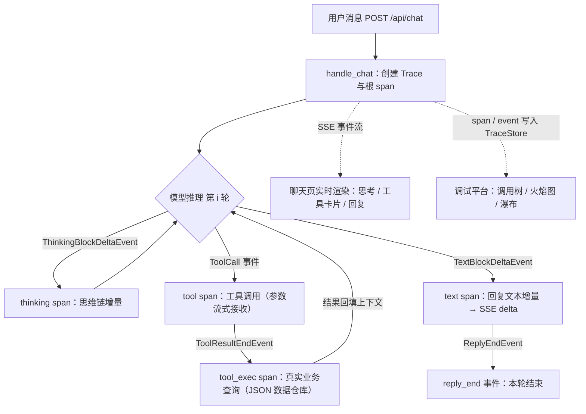

# 云雀商城 toC 智能客服系统

基于 [AgentScope 2.0](https://github.com/agentscope-ai/agentscope) SDK 层构建的面向 C 端消费者的智能客服系统。后端使用 AgentScope 的 `Agent` / `FunctionTool` / `ChatModelBase` / `AgentState` 编排完整「意图识别 → 思考 → 工具调用 → 回复」链路，前端通过 SSE 实时流式展示思考过程、工具调用与回复增量。

> 开箱即用：**无需任何 API Key**，内置离线规则模型即可完整体验（见下方 [快速开始](#快速开始)）。配置 `DASHSCOPE_API_KEY` 后即可切换到通义千问。

---

## 功能特性

- **售前 / 售中 / 售后全流程客服**：浏览商品、查询详情、加购物车、查看购物车、下单、支付，以及查订单、查物流、查用户会员（积分 / 优惠券 / 会员等级）、FAQ 政策问答、申请退款退货、取消订单、创建售后工单、转人工，形成「逛 → 买 → 支付 → 售后」电商闭环。
- **真实工具调用**：涉及订单 / 物流 / 退款 / 用户信息时，智能体强制调用查询类工具（`is_read_only=True`），不编造数据；写操作（退款 / 取消 / 建工单）需向用户说明并征得同意。
- **数据落地**：业务数据以 JSON 文件模拟电商后台，接口与真实订单中台对齐，替换实现即可接入真实系统（见 [接入真实中台](#接入真实中台)）。
- **三档模型**：`dashscope`（通义千问）/ `openai`（任意 OpenAI 兼容端点）/ `mock`（内置离线规则模型）。
- **多会话隔离**：每会话持有独立 Agent，上下文保存在 `AgentState.context`，含 LRU 淘汰与闲置回收。
- **管理后台**：运营 / 人工客服可在 `http://127.0.0.1:8000/admin` 查看会话、处理工单、维护 FAQ 知识库、浏览订单与用户。
- **流式体验**：SSE 实时推送 `thinking / delta / tool_call / tool_call_args / tool_result / done / hint / error` 事件；前端展示思考折叠区、工具卡片、会话侧边栏。
- **调试平台（Fire Trace）**：`/debug` 把每条消息的推理链路完整可视化——推理步骤流水线、Trace 列表、调用树、火焰图（单条 / 聚合）、瀑布时间线（见 [调试平台（Fire Trace）](#调试平台fire-trace)）。

## 演示场景

| 你想做什么 | 直接对机器人说 |
| --- | --- |
| 浏览商品 / 推荐 | 「想买个降噪耳机，推荐一下」 |
| 加购物车 | 「把 P1001 加进购物车 2 个」 |
| 看购物车 | 「看看我的购物车」 |
| 下单 | 「把购物车里的东西下单，送到文三路 199 号」 |
| 支付 | 「支付订单，用满 300 减 50 的券」 |
| 查物流 | 「帮我查一下订单 SO20260810001 的物流」 |
| 按手机号定位订单 | 「手机号后四位 3721，看下我最近的订单」 |
| 查会员 / 积分 / 优惠券 | 「我是黄金会员，有什么权益？」或「看看我的积分和优惠券」 |
| 政策问答 | 「退货规则是什么？」「运费怎么算？」「发票怎么开？」 |
| 申请退款 | 「我想把 SO20260812003 这个订单退了」 |
| 取消订单 | 「取消订单 SO20260815005」 |
| 转人工 | 「我要转人工客服」 |

演示订单：`SO20260810001`（已发货，可查物流）、`SO20260812003`（待发货，可退款）、`SO20260815005`（待付款，可取消）。手机号后四位 `3721` / `9084`。

## 快速开始

### 1. 创建虚拟环境并安装依赖

需要 Python 3.10+。项目依赖见 `requirements.txt`（核心为 `agentscope>=2.0.6`、`fastapi`、`uvicorn`、`httpx`、`pytest`）。

```bash
python -m venv .venv
# Windows
.venv\Scripts\activate
# macOS / Linux
source .venv/bin/activate

pip install -r requirements.txt
```

### 2.（可选）配置模型

默认使用内置离线 mock 模型，无需任何配置即可体验完整流程。若想使用真实大模型，复制 `.env.example` 为 `.env` 并按需填写：

```ini
# ===== 主模型配置 =====
# 方式一：通义千问（DashScope，推荐中文客服场景）
DASHSCOPE_API_KEY=sk-xxxx
DASHSCOPE_MODEL=qwen-plus

# 方式二：OpenAI / 任意 OpenAI 兼容端点（通过 base_url 指向自建网关）
OPENAI_API_KEY=sk-xxxx
OPENAI_BASE_URL=https://api.openai.com/v1
OPENAI_MODEL=gpt-4o-mini

MODEL_PROVIDER=dashscope   # dashscope / openai / mock，缺省时自动判断

# ===== 服务降级配置 =====
# 主模型超时/异常时自动降级到备用模型，保证业务不中断
DEGRADATION_ENABLED=true       # true=启用自动降级（默认）
FALLBACK_PROVIDER=mock          # 降级模型：mock（离线）/ dashscope / openai
FALLBACK_MODEL=offline-mock     # 降级模型名称
FALLBACK_TIMEOUT_SECONDS=30     # 主模型超时阈值（秒）
```

不填 `MODEL_PROVIDER` 时的自动判断：有 `DASHSCOPE_API_KEY` 用 dashscope，否则有 `OPENAI_API_KEY` 用 openai，都没有则回退 mock。

### 3. 启动服务

```bash
python run.py                    # 使用 .env / 环境变量配置（默认 0.0.0.0:8000）
python run.py --port 9000        # 自定义端口
```

启动后打开 `http://127.0.0.1:8000` 即可使用前端。健康检查：`GET /api/health`。

## AgentScope 2.0 架构映射

| AgentScope 2.0 概念 | 本项目实现 | 说明 |
| --- | --- | --- |
| `Agent` | `backend/agent_factory.py` | 每个会话一个 Agent，驱动推理-行动循环；`system_prompt`、`model`、`toolkit`、`state` 注入 |
| `ChatModelBase` | `backend/models.py`、`backend/mock_model.py` | 三档模型统一实现 `ChatModelBase` 契约；离线模型产出 `is_last=False` 增量块，由框架自动累积补发 `is_last=True` |
| `FunctionTool` / `Toolkit` | `backend/tools/` | 通过标准 docstring `Args:` 段自动解析工具 schema；`is_read_only` 标记只读查询工具 |
| `AgentState` | `backend/session_manager.py` | 每会话独立 `AgentState`，`context` 即对话历史；权限上下文用 `PermissionMode.BYPASS`（服务端托管） |
| 事件流 | `backend/service.py` | 订阅 `TextBlockDeltaEvent` / `ThinkingBlockDeltaEvent` / `ToolCall*Event` / `ToolResultEndEvent` / `ReplyEndEvent` 等并翻译为 SSE |
| RAG 知识库 | `backend/tools/knowledge.py` | 本地关键词 + 字符二元组相似度实现，签名与外部向量库兼容，可替换为 Qdrant / Milvus + Embedding |

## 推理步骤图解

每条用户消息都会走一遍「推理-行动（ReAct）」循环，调试平台把循环中的每一阶段记录为 span / event：



- **span**（有起止时间）：`root → agent → thinking / text / tool → tool_exec`，构成调用树与火焰图。
- **event**（瞬时打点）：如 `reply_end`，画在瀑布时间线上。
- 一轮对话可能包含多次「思考 → 工具」循环（例如「查订单 → 退款」为两轮循环）。

## 项目结构

```
.
├── backend/
│   ├── agent_factory.py     # Agent / Toolkit / State 编排
│   ├── models.py            # 模型工厂（dashscope / openai / mock）
│   ├── mock_model.py        # 离线规则模型（驱动完整 ReAct + 工具链路，多轮追问实体继承）
│   ├── prompts.py           # 系统提示词 + 快捷问题
│   ├── service.py           # 事件流 → SSE 翻译、历史重建、Trace 埋点
│   ├── tracing.py           # 推理链路追踪（Span/Trace、火焰图聚合）
│   ├── debug.py             # 调试平台 API 路由（/api/debug/*）
│   ├── server.py            # FastAPI：REST + SSE + 静态前端
│   ├── session_manager.py   # 多会话管理（LRU + 闲置 GC）
│   ├── schemas.py           # Pydantic 接口模型
│   ├── config.py            # .env 配置加载
│   ├── tools/               # 17 个业务工具（含购物：商品/购物车/下单/支付）
│   ├── store/               # JSON 数据仓库（订单/用户/FAQ/工单/商品/购物车）
│   └── data/                # JSON 演示数据
├── web/                     # 前端：聊天页（index.html / app.js / style.css）、
│   │                        # 管理后台（admin.html / admin.js / admin.css）、
│   │                        # 调试平台（debug.html / debug.js / debug.css）
├── backend/admin.py           # 管理后台 API 路由（/api/admin/*）
├── tests/test_flow.py       # 端到端流程 + HTTP/SSE/调试 API 冒烟测试
├── run.py                   # 启动入口
└── requirements.txt
```

## 管理后台

C 端聊天页之外，还提供一个面向运营 / 人工客服的管理后台，地址 `http://127.0.0.1:8000/admin`（聊天页底部有入口，后台左侧可返回聊天页）。

- **概览**：实时统计当前会话、已转人工、工单（总数 / 待处理 / 已完成）、订单数、用户数。
- **会话监控**：查看所有进行中的客服会话与对话历史（含思考过程与工具调用），每 15 秒自动刷新。
- **工单中心**：查看用户通过转人工 / 投诉 / 售后产生的工单，支持改状态（待处理 / 处理中 / 已完成 / 已转人工）、指派受理人、填写回复。
- **FAQ 管理**：知识库增删改查，改动即时生效，可显著影响机器人的政策类回答。
- **商品管理**：商品库增删改查，改动即时生效，供机器人推荐与加购使用。
- **订单 / 用户**：浏览演示数据，便于核对与测试。

后台数据复用 `backend/store` 的 JSON 仓库，会话数据来自内存 SessionManager。

## 调试平台（Fire Trace）

地址 `http://127.0.0.1:8000/debug`（聊天页底栏与后台页脚均有入口）。面向学习与调试：把每次对话的推理链路完整可视化。数据来自内存 `TraceStore`（`backend/tracing.py`），随进程存在，无需数据库。

- **推理总览**：统计卡片（trace 总数 / 成功率 / 平均耗时 / 平均 TTFT）、ReAct 推理步骤流水线图、工具调用耗时榜，一键「再来一条」产生新 trace。
- **Trace 列表**：按时间倒序的全部 trace，支持按消息文字 / 工具名 / trace_id 搜索与按会话过滤，点击即联动右侧视图。
- **调用树**：span 层级树（`root → agent → thinking / tool → tool_exec`），逐节点展示耗时、状态与参数 / 结果详情。
- **火焰图**：单条 trace 的火焰图，或把最近 N 条按 `(kind, name)` 路径聚合成一张全局火焰图，条宽即耗时占比。
- **瀑布时间线**：span 甘特条 + `reply_end` 等瞬时事件打点，直观看到 TTFT 与各工具耗时在整轮中的位置。

调试 API 由 `backend/debug.py` 提供，前缀 `/api/debug`：

| 方法 | 路径 | 说明 |
| --- | --- | --- |
| `GET` | `/api/debug/summary` | 汇总统计（总数 / 成功率 / 平均耗时 / 工具耗时榜） |
| `GET` | `/api/debug/traces` | trace 列表（`limit` / `q` / `session_id`） |
| `GET` | `/api/debug/traces/{id}` | 单条 trace 完整 span / event 明细 |
| `GET` | `/api/debug/flamegraph` | 火焰图数据；带 `trace_id` 为单条，否则聚合最近 `limit` 条 |
| `GET` | `/api/debug/latest` | 最新一条 trace 明细 |
| `POST` | `/api/debug/clear` | 清空全部 trace |

## API 说明

| 方法 | 路径 | 说明 |
| --- | --- | --- |
| `GET` | `/api/health` | 健康检查，返回当前 provider / model |
| `GET` | `/api/config` | 前端初始化配置（智能体名、品牌名、快捷问题等） |
| `POST` | `/api/sessions` | 创建会话，返回 `session_id` |
| `GET` | `/api/sessions` | 列出会话（含消息数、预览、是否已转人工） |
| `GET` | `/api/sessions/{id}/history` | 回放某会话历史消息（含思考与工具调用） |
| `POST` | `/api/chat` | 发送消息，返回 SSE 事件流 |
| `GET` | `/api/admin/stats` | 后台概览统计 |
| `GET` | `/api/admin/sessions` | 后台：会话监控，含 `/sessions/{id}/history` |
| `GET` / `PATCH` | `/api/admin/tickets`、`/tickets/{id}` | 后台：工单查看与处理 |
| `GET` / `POST` | `/api/admin/faq` | 后台：FAQ 查看与新增 |
| `PUT` / `DELETE` | `/api/admin/faq/{id}` | 后台：FAQ 编辑 / 删除 |
| `GET` | `/api/admin/orders`、`/api/admin/users` | 后台：订单 / 用户概览 |
| `GET` / `POST` | `/api/admin/products` | 后台：商品查看与新增 |
| `PUT` / `DELETE` | `/api/admin/products/{sku}` | 后台：商品编辑 / 删除 |
| `GET` | `/admin` | 管理后台前端页面 |
| `GET` | `/debug` | 调试平台前端页面 |
| `GET` / `POST` | `/api/debug/*` | 调试平台数据接口，见 [调试平台（Fire Trace）](#调试平台fire-trace) |

`POST /api/chat` 请求体：

```json
{ "session_id": "sess_xxxx", "message": "帮我查订单 SO20260810001 的物流" }
```

SSE 事件（`event:` + `data:` JSON）：

- `meta`：会话 / 智能体元信息
- `thinking`：思考增量
- `delta`：回复文本增量
- `tool_call` / `tool_call_args` / `tool_result`：工具调用与结果
- `done` / `error` / `hint` / `confirm_required`：结束与状态

## 测试

```bash
pytest -v
```

`tests/test_flow.py` 使用离线 mock 模型，无需网络 / API Key。覆盖：物流查询、退款链路（含店铺数据落库校验）、FAQ 检索、转人工、购物下单支付、多轮对话追问（指代实体继承、短句确认、裸数字应答）、多条件选品（如“300以内的耳机”价格上限过滤）、`/api/config`、`/api/chat` SSE 与 `/api/debug/*` 调试接口冒烟。测试通过 `autouse` fixture 自动备份并还原 `backend/data/` 下的 JSON，不会污染演示数据。

## 接入真实中台

业务数据全部通过 `backend/store/mock_store.py` 暴露（`order_store` / `user_store` / `faq_store` / `ticket_store` / `product_store` / `cart_store`，均为读-改-写 + 文件锁的 JSON 实现）。接入真实电商后台时，保持各 `Store` 的方法签名不变，将内部实现替换为对真实数据库 / 中台网关的调用即可，工具层与智能体层无需改动。

若需线上向量检索 FAQ，可将 `backend/tools/knowledge.py` 的 `search_faq` 实现替换为 AgentScope RAG（Qdrant / Milvus + Embedding 模型）。

## 隐私与安全

- 只读查询工具（查订单 / 物流 / 用户 / FAQ）与写操作工具（退款 / 取消 / 建工单 / 转人工）分离。
- 服务端以 `PermissionMode.BYPASS` 托管工具调用，C 端用户无需逐条确认，但退款 / 取消等写操作由提示词约束先征得用户同意。
- 不向用户复述完整手机号等敏感信息，仅展示后四位。
- 生产部署建议：为 `/api/chat` 增加鉴权、限流与会话级校验；`MAX_SESSIONS` / `SESSION_TTL_MINUTES` 可按需调整。
